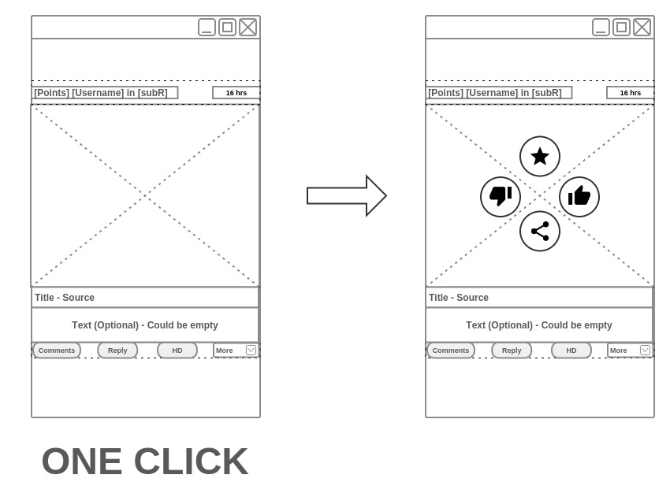

# redgram-for-reddit
An Android Reddit client focusing primarily on media images/videos.

--------------

##Introduction

As an individual developer, I am interested in showcasing the workflow I'm going through. This project uses the 
[Reddit API](http://www.reddit.com/dev/api) to fetch user data and display it to the end user. What makes it different from other
clients in the market is its focus on media images, including animated ones (GIFs), and the methods used to download the data which are efficient
and reliable. Most clients display thumbnails to the end user or low quality images until the user decides to view the full version.

This app will focus on rendering the best quality image possible in large views instead of downloading the full version of it in
order to minimize network data consumption as some media content tend to be large in size. The user will also have the option to render
the whole thing.

Also, Reddit and [Imgur](https://imgur.com/) (an image hosting site) work friendly together and users frequently link to their hosted images
in their Reddit posts, either as the image itself or a link to image page as a whole. Imgur allows flexible viewing of their URL's and it also has its own API to access its database. 

While the app will *eventually* include all features in Reddit, it will make use of Imgur API to get images that are within albums
and galleries, provided their set of image URL's. Luckily, Reddit's API can determine in what cases other API's are required.

##Potential Plan

A boilerplate of the app shall be released at first, which will include a basic usage of [public endpoints such as this 
one](http://www.reddit.com/r/aww.json), and it shall provide a base to the whole app from where extra features could be developed
and added. 

Design previews will be added to this README file till there is enough content to organize all information.

**The base includes:**

- Fully documented code
- The [MVP pattern](http://en.wikipedia.org/wiki/Model%E2%80%93view%E2%80%93presenter)
- Custom Navigation Drawer
- Custom Toolbar Animation
- Reddit API client using Retrofit with custom deserializers (thanks to [jacobtabak's repo](https://github.com/jacobtabak/droidcon))
- RxJava/Android + Retrofit use case
- The new [Fresco](http://frescolib.org/) library for obtaning images from the device/cache/network

##MVP Pattern

The **Model-View-Presenter** pattern's main advantage is keeping the UI or views away from obtaining the data and make it deal with
updating themselves as the data becomes available only. For this, the use of (base) interfaces is recommended so Fragments 
can share similar actions by implementing them while the presenters has a reference of these Fragments so it would be able to
call for UI changes as the data is (being) obtained. 

For the data to be sent back and forth, an event bus is used, which is a singleton that pass data around between classes and/or
Activities/Fragments. So as the data is being obtained asynchronously, an event is emitted, and an update is reflected
to the end user immediately, as long as the view is subscribed to the bus. This project will be using [Eventbus](https://github.com/greenrobot/EventBus).

Here is a really nice project that illustrates it really well -> [Material-Movies](https://github.com/saulmm/Material-Movies)

##Use of RxJava

[RxJava](https://github.com/ReactiveX/RxJava) *is a library for composing asynchronous and event-based programs 
by using observable sequences. It has built-in operators such as aggregators and ways to be implemented synchronously 
if needed.*

The use here shall be for *ensuring data from different endpoints are obtained, and displayed later, at the same time,
while throwing errors if one of the Observables (source of data) fails to operate*. Fortunately, RxJava works pretty well with
Retrofit, which is responsible for obtaining/updating data from the API's, and an [Android library](https://github.com/ReactiveX/RxAndroid)
is availble as well to provide a Scheduler to handle UI threads.

The documentation and resources explain things really well, so it is recomended to go through them step by step.

I am willing to create another repo just to explain my experience in learning
RxJava under Redgram.

##Diagrams

There will be a section to showcase the design approaches for essential and complex views throughout the app.

Here is an example of the current item view drawn using [Gliffy](http://www.gliffy.com):

------------

**I am currently practicing RxJava and implementing the image manager that will be responsible for viewing 
the possible image types and sizes.**  

Watch this repo as I will be updating it frequently from now on.

